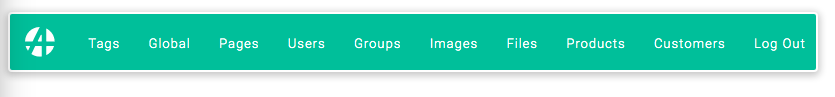

# Headless Apostrophe with Docker / Nuxt / Nginx

This project is a demonstration of using Apostrophe in headless mode, adding Nuxt for the frontend, and Nginx as reverse-proxy.


## Without Docker

### Installation

Having `npm` and `node` installed on the machine, run `npm run install-app`.

### Usage

Go to `http://localhost:1337/apos` to access the backend and `http://localhost:3333` for the frontend.

## With Docker

### Installation

Having `docker` installed, run `make`.

### Usage

Run `make` for the `development` environment, `make prod` for the `production` environment.
Go to `http://localhost/apos` to access the backend and `http://localhost` for the frontend.

### Other Docker commands

Run `docker-compose up` for production in Docker or `make prod`.

`docker-compose ps` for running instances.<br />
`docker-compose stop`<br />
`docker-compose build` to rebuild image<br />
`docker run -ti apos-nuxt-demo_demo-demo-backend sh` to log into the container<br />

Save database:
`docker run --rm --link demo-db:mongo --net apos-nuxt-demo_demo_default -v $(pwd)/server/data/db:/backup mongo bash -c 'mongodump --out /backup --host mongo:27018 --db network'`

Drop database:
`docker exec network-db mongo --port 27018 --eval "db.getSiblingDB('apos-nuxt-demo').dropDatabase()";`

Restore in container:
'docker run --rm --link demo-db:mongo --net apos-nuxt-demo_demo_default -v \$(pwd)/server/data/db:/backup mongo mongorestore /backup --host mongo:27018'

### Fixtures

docker-compose exec demo-backend node app fixtures:all

### Clear Docker logs

dev: docker run -it --rm --privileged --pid=host apos-nuxt-demo_demo-demo-backend nsenter -t 1 -m -u -n -i -- sh -c 'truncate -s 0 /var/lib/docker/containers/*/*-json.log'

### Nginx

You can access Nginx logs by going to `/reverse-proxy/logs`.

## Tutorial

We are going to create an online restaurant shop, enabling visitors to register and order food.

Start by cloning this project.

`git clone git@github.com:falkodev/apos-nuxt-demo.git` //TODO: change url to an apostrophe one when ready

If you have Docker installed, run `make` otherwise `npm run install-app`. `http://localhost:1337/apos` for the backend and `http://localhost:3333` for the frontend should be accessible (ports are not mandatory if you use Docker).

We are going to create dishes for our customers. To facilitate this step, fixtures have been created. They will create an admin user on Apostrophe, and documents in the "Products" module.

Here is the schema of the "Products" module:

```js
{
  name: 'description',
  type: 'string',
  required: true,
},
{
  name: 'picture',
  type: 'attachment',
  group: 'images',
}
```

By default, Apostrophe adds a title, a slug, a "published" status, and a "trash" status to every piece. In this schema, we add a description and a picture.

On another teminal, run `docker-compose exec demo-backend node app fixtures:all` if you use Docker, `cd backend && node app fixtures:all` otherwise.

Now, go to `http://localhost:1337/apos/login` and enter the following credentials: "admin" as username, "admin" as password.

<br><br>

The Apostrophe admin bar will be displayed.

<br><br>

You can click on "Products" to look at the generated products by the "fixtures" step.

<br><br>
<br><br>

If you reload `http://localhost:3333`, you will see the products are now displayed.

<br><br>

How does this work?

On the backend, [`apostrophe-headless`](https://github.com/apostrophecms/apostrophe-headless) has been installed, and the products module has been declared as a headless module with the `restApi` option, therefore exposing REST routes:

```js
// backend/lib/modules/products/index.js
module.exports = {
  extend: 'apostrophe-pieces',
  name: 'product',
  alias: 'product',
  restApi: true,
  ...
}
```

This way, products are automatically exposed on `/api/v1/products`. On the frontend, the `index` page fetches the products on this route. Nuxt declares pages in the `pages` folder. `index.vue` is thus the default page. In the `asyncData` method in this component, the following GET request is made:

```js
// in frontend/pages/index.vue
const { results } = await $axios.$get('/api/v1/products')
```

The products are displayed in the component's template part, with a classical `v-for` loop:

```html
<!-- in frontend/pages/index.vue -->
<template>
  <section class="homepage">
    <div class="homepage-products">
      <div v-for="product in products" :key="product._id" class="homepage-products__item">
        
        <span>{{ product.description }}</span>
      </div>
    </div>
  </section>
</template>
```

You can notice Apostrophe has automatically resized the pictures. We chose to display the "one-third" format here.

Now, if you want to add text on this homepage, you could edit the Vue component, but it is not convenient. A better way is to edit the content in Apostrophe, and let it be displayed on the frontend.

For that, a page type "homepage" has been configured on the backend:

```js
// in backend/lib/modules/apostrophe-pages/index.js
module.exports = {
  restApi: true,
  apiTemplates: ['front-homepage'],
  types: [
    {
      name: 'front-homepage',
      label: 'Front Homepage',
    },
  ],
  ...
}
````

The `apostrophe-pages` modules has also the `restApi` option and defines one page type an Apostrophe editor can create: `front-homepage`. Also, with `apiTemplates: ['front-homepage']` we indicate to expose the rendered template.

Let's create a "front-homepage" page by clicking on "Pages" in the Apostrophe admin bar and "New Page", and then filling the "New Page" form:

<br><br>

The `title` and `slug` fields do not really matter. What it is important is the `type` field: "Front Homepage".

Then, on this new page, click on the "+" icon and add a "Columns Layout" widget.

<br><br>

This type of widget is useful when you need to divide the screen. For example, here is what you could do with a 2-column layout:

<br><br>

But that is not what we are doing. For the moment, choose "1 column". Now you have access to other widgets. Choose "Text Link".

<br><br>

Last step for this widget: you have access to "Rich Text" and "Link". Choose "Rich Text" and start to type text. For example:

<br><br>

To get the same color and background color, play the style selector in the rich-text toolbar:

<br><br>

Hovering just below the rich text zone, a green bar will appear and you can add another widget. Choose "Link" this time. Here are suggested settings (if you do not use Docker, be sure to type `http://localhost:3333/login` in the URL field):

<br><br>

And the result, still in Apostrophe:

<br><br>

Now you can go to the frontend and reload the page (`http://localhost` on Docker, `http://localhost:3333` otherwise).

<br><br>

How does this work? Again, in the `index.vue` component (in `frontend/pages/`), the `asyncData` method fetches the pages exposed by Apostrophe, and finds the homepage we created. You can click the "Order" button, it should lead you to the login page.

Now, let's create a user and order food!

Add a "customer" module: create a folder "customers" under `backend/lib/modules` with a `index.js` file in it with this content:

```js
module.exports = {
  extend: 'apostrophe-pieces',
  name: 'customer',
  alias: 'customer',
  restApi: true,
  addFields: [
    {
      name: 'username',
      type: 'string',
      required: true,
    },
    {
      name: 'password',
      type: 'password',
      min: 4,
      max: 20,
      required: true,
    },
  ],
  arrangeFields: [
    {
      name: 'basics',
      label: 'Basics',
      fields: ['title', 'slug', 'username', 'password', 'published', 'tags'],
    },
  ],
  removeFields: ['tags'],
}
```

Then add this line to `backend/app.js`, under `products: {}`:

```js
module.exports = require('apostrophe')({
  ...
  modules: {
    ...,
    customers: {},
  }
})
```

Now, a new category "Customers" has appeared in the Apostrophe admin bar:

<br><br>

