# Headless Apostrophe with Docker / Nuxt / Nginx

This project is a demonstration of using Apostrophe in headless mode, adding Nuxt for the frontend, and Nginx as reverse-proxy.

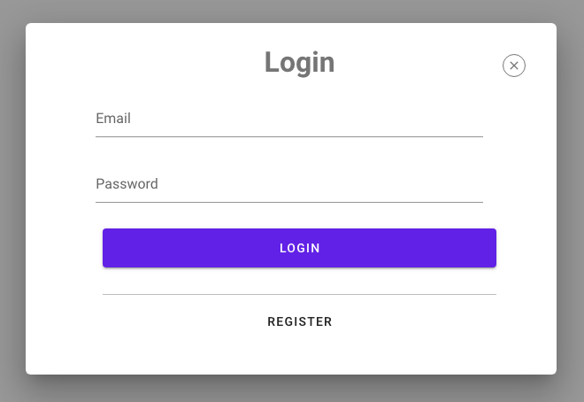

## Without Docker

### Installation

Having `npm` and `node` installed on the machine, run `npm run install-app`.

### Usage

Go to `http://localhost:1337/cms` to access the backend and `http://localhost:3333` for the frontend.

## With Docker

### Installation

Having `docker` installed, run `make`.

### Usage

Run `make` for the `development` environment, `make prod` for the `production` environment.
Go to `http://localhost/cms` to access the backend and `http://localhost` for the frontend.

### Other Docker commands

Run `docker-compose up` for production in Docker or `make prod`.

`docker-compose ps` for running instances.<br />
`docker-compose stop`<br />
`docker-compose build` to rebuild image<br />
`docker run -ti apos-nuxt-demo_demo-demo-backend sh` to log into the container<br />

Save database:
`docker run --rm --link demo-db:mongo --net apos-nuxt-demo_demo_default -v $(pwd)/server/data/db:/backup mongo bash -c 'mongodump --out /backup --host mongo:27018 --db network'`

Drop database:
`docker exec network-db mongo --port 27018 --eval "db.getSiblingDB('apos-nuxt-demo').dropDatabase()";`

Restore in container:
'docker run --rm --link demo-db:mongo --net apos-nuxt-demo_demo_default -v \$(pwd)/server/data/db:/backup mongo mongorestore /backup --host mongo:27018'

### Fixtures

docker-compose exec demo-backend node app fixtures:all

### Clear Docker logs

dev: docker run -it --rm --privileged --pid=host apos-nuxt-demo_demo-demo-backend nsenter -t 1 -m -u -n -i -- sh -c 'truncate -s 0 /var/lib/docker/containers/*/*-json.log'

### Nginx

You can access Nginx logs by going to `/reverse-proxy/logs`.

## Tutorial

We are going to create an online restaurant shop, enabling visitors to register and order food.

Start by cloning this project.

`git clone git@github.com:falkodev/apos-nuxt-demo.git` //TODO: change url to an apostrophe one when ready

If you have Docker installed, run `make` otherwise `npm run install-app`. `http://localhost:1337/cms` for the backend and `http://localhost:3333` for the frontend should be accessible (ports are not mandatory if you use Docker).

We are going to create dishes for our customers. To facilitate this step, fixtures have been created. They will create an admin user on Apostrophe, and documents in the "Products" module.

Here is the schema of the "Products" module:

```js
{
  name: 'description',
  type: 'string',
  required: true,
},
{
  name: 'picture',
  type: 'attachment',
  group: 'images',
}
```

By default, Apostrophe adds a title, a slug, a "published" status, and a "trash" status to every piece. In this schema, we add a description and a picture.

On another teminal, run `docker-compose exec demo-backend node app fixtures:all` if you use Docker, `cd backend && node app fixtures:all` otherwise.

Now, go to `http://localhost:1337/cms/login` and enter the following credentials: "admin" as username, "admin" as password.

<br>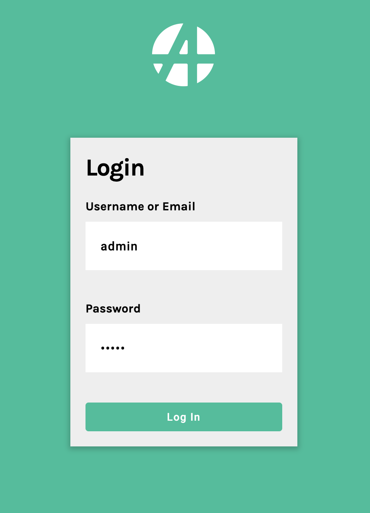<br>

The Apostrophe admin bar will be displayed.

<br>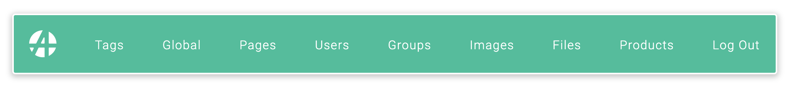<br>

You can click on "Products" to look at the generated products by the "fixtures" step.

<br>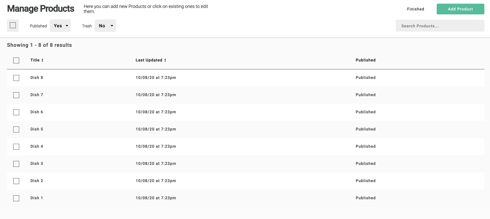<br>
<br>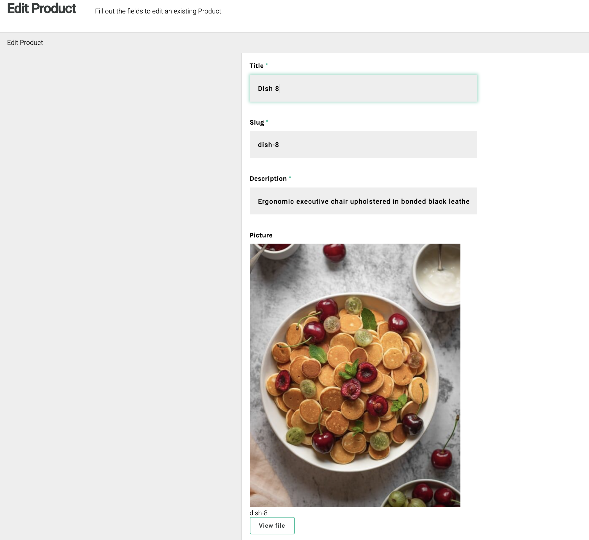<br>

If you reload `http://localhost:3333`, you will see the products are now displayed.

<br><br>

How does this work?

On the backend, [`apostrophe-headless`](https://github.com/apostrophecms/apostrophe-headless) has been installed, and the products module has been declared as a headless module with the `restApi` option, therefore exposing REST routes:

```js
// backend/lib/modules/products/index.js
module.exports = {
  extend: 'apostrophe-pieces',
  name: 'product',
  alias: 'product',
  restApi: true,
  ...
}
```

This way, products are automatically exposed on `/api/v1/products`. On the frontend, the `index` page fetches the products on this route. Nuxt declares pages in the `pages` folder. `index.vue` is thus the default page. In the `asyncData` method in this component, the following GET request is made:

```js
// in frontend/pages/index.vue
const { results } = await $axios.$get('/api/v1/products')
```

The products are displayed in the component's template part, with a classical `v-for` loop:

```html
<!-- in frontend/pages/index.vue -->
<template>
  <section class="homepage">
    <div class="homepage-products">
      <div v-for="product in products" :key="product._id" class="homepage-products__item">
        
        <span>{{ product.description }}</span>
      </div>
    </div>
  </section>
</template>
```

You can notice Apostrophe has automatically resized the pictures. We chose to display the "one-third" format here.

Now, if you want to add text on this homepage, you could edit the Vue component, but it is not convenient. A better way is to edit the content in Apostrophe, and let it be displayed on the frontend.

For that, a page type "homepage" has been configured on the backend:

```js
// in backend/lib/modules/apostrophe-pages/index.js
module.exports = {
  restApi: true,
  apiTemplates: ['front-homepage'],
  types: [
    {
      name: 'front-homepage',
      label: 'Front Homepage',
    },
  ],
  ...
}
````

The `apostrophe-pages` modules has also the `restApi` option and defines one page type an Apostrophe editor can create: `front-homepage`. Also, with `apiTemplates: ['front-homepage']` we indicate to expose the rendered template.

Let's create a "front-homepage" page by clicking on "Pages" in the Apostrophe admin bar and "New Page", and then filling the "New Page" form:

<br>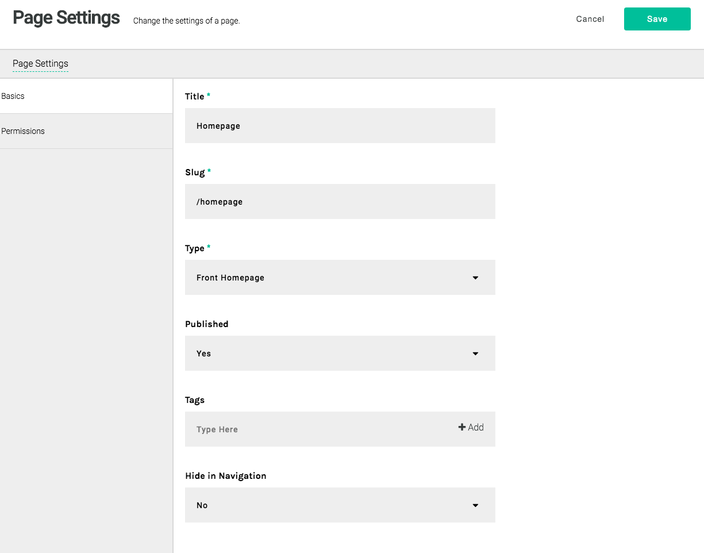<br>

The `title` and `slug` fields do not really matter. What it is important is the `type` field: "Front Homepage".

Then, on this new page, click on the "+" icon and add a "Columns Layout" widget.

<br>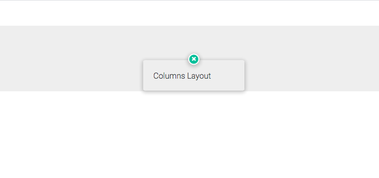<br>

This type of widget is useful when you need to divide the screen. For example, here is what you could do with a 2-column layout:

<br>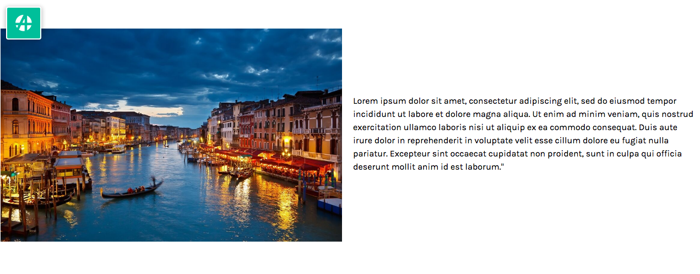<br>

But that is not what we are doing. For the moment, choose "1 column". Now you have access to other widgets. Choose "Text Link".

<br>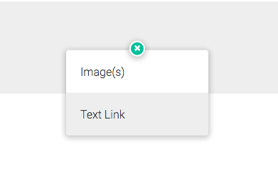<br>

Last step for this widget: you have access to "Rich Text" and "Link". Choose "Rich Text" and start to type text. For example:

<br>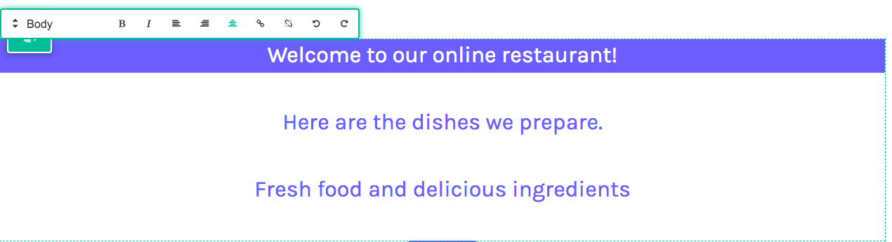<br>

To get the same color and background color, play the style selector in the rich-text toolbar:

<br>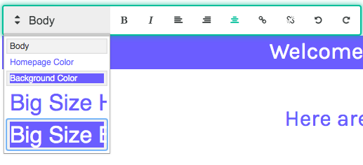<br>

Hovering just below the rich text zone, a green bar will appear and you can add another widget. Choose "Link" this time. Here are suggested settings (if you do not use Docker, be sure to type `http://localhost:3333/login` in the URL field):

<br>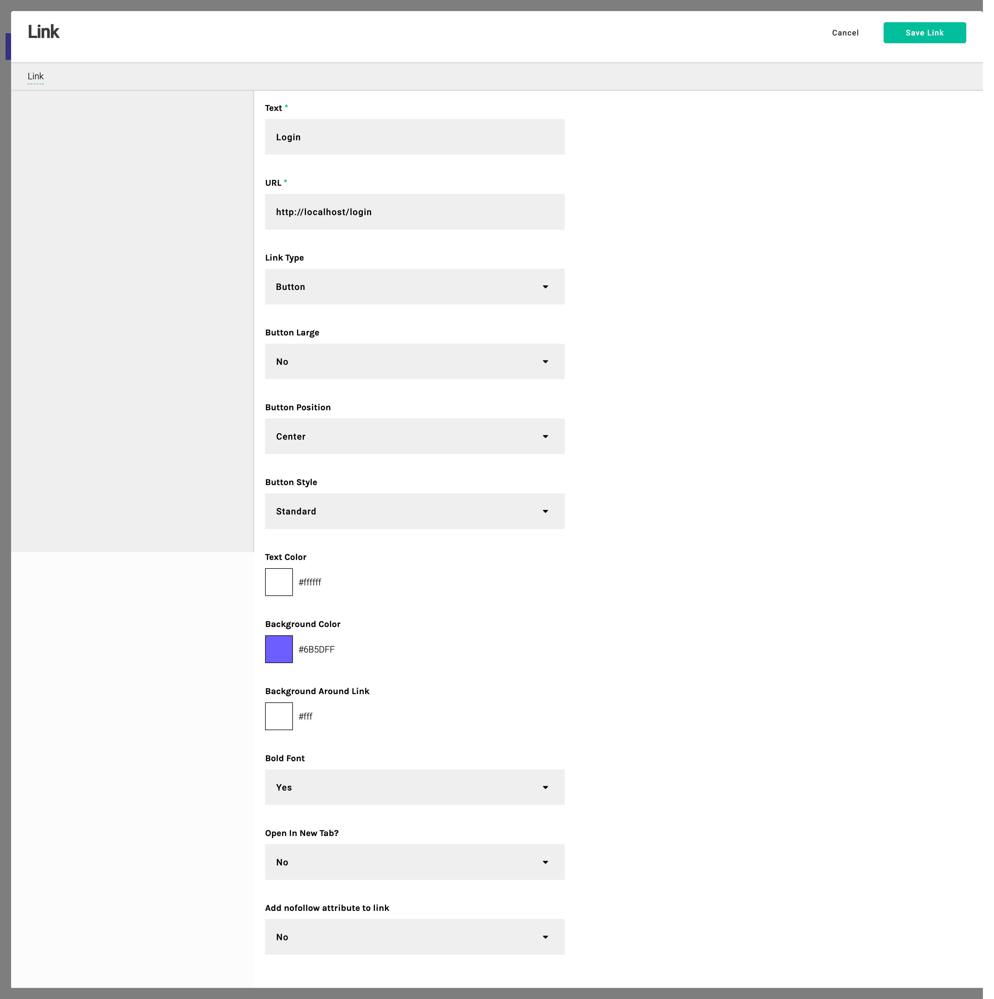<br>

And the result, still in Apostrophe:

<br>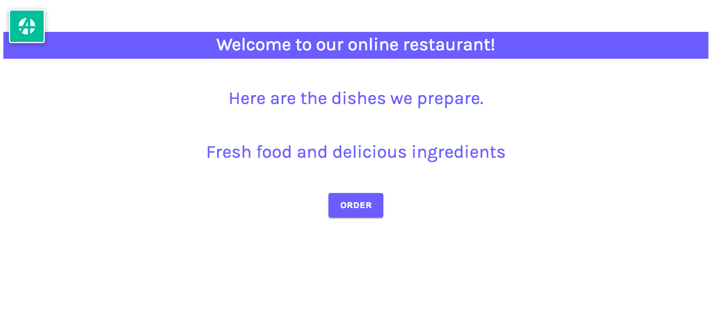<br>

Now you can go to the frontend and reload the page (`http://localhost` on Docker, `http://localhost:3333` otherwise).

<br>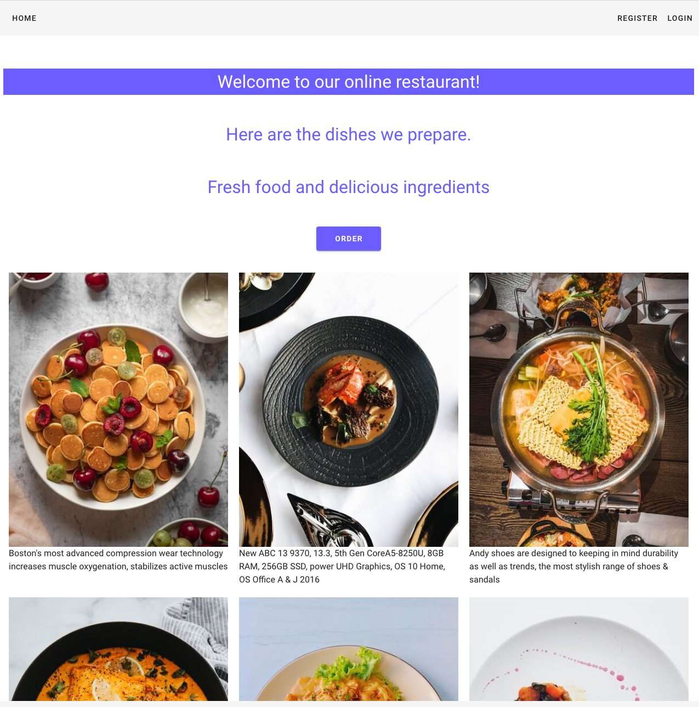<br>

How does this work? Again, in the `index.vue` component (in `frontend/pages/`), the `asyncData` method fetches the pages exposed by Apostrophe, and finds the homepage we created. You can click the "Order" button, it should lead you to the login page.

Now, let's create a user and order food!

Click on "Register" in the frontend bar. Add an email and a password. The registration should be successful. To check, now click on the "Login" button and enter the credentials you used in the previous step. A welcome message is display on success.

How does this work?

Edit `frontend/components/Register.vue`. You can observe the component calls `/modules/apostrophe-users/register` when submitting the form.
On the backend, the `apostrophe-users` module has a custom route

```js
self.route('post', 'register', async (req, res) => { ... }
```

where it creates a new user. This user can log in because:

- in `frontend/nuxt.config.js`, there is a Nuxt plugin for authentication, indicating which route to use for the login

```js
auth: {
  plugins: ['~/plugins/auth.js'],
  rewriteRedirects: true,
  fullPathRedirect: true,
  watchLoggedIn: false,
  strategies: {
    local: {
      endpoints: {
        login: { url: '/api/v1/login', method: 'post', propertyName: 'bearer' },
        logout: { url: '/api/v1/logout', method: 'post' },
        user: false,
      },
    },
  },
},
```

- and in `frontend/components/Login.vue`, the component uses this plugin to trigger the login action

```js
const response = await this.$auth.loginWith('local', {
  data: {
    username: this.email,
    password: this.password,
  },
})
```

Apostrophe replies to this action by checking the password with its saved hash and sends back a bearer token.

To order food, we need a dedicated module. Create a new folder under `backend/lib/modules` and name it `orders`. Create an `index.js` file in it with this content:

```js
module.exports = {
  extend: 'apostrophe-pieces',
  name: 'order',
  alias: 'order',
  restApi: true,
  addFields: [
    {
      name: 'date',
      type: 'date',
      required: true,
    },
    {
      name: '_products',
      type: 'joinByArray',
      required: true,
      relationship: [
        {
          name: 'quantity',
          label: 'Quantity',
          type: 'integer',
        }
      ],
    },
    {
      name: '_customer',
      type: 'joinByOne',
      withType: 'apostrophe-user',
      required: true,
    },
  ],
  arrangeFields: [
    {
      name: 'basics',
      label: 'Basics',
      fields: ['title', 'date', '_products', '_customer', 'published'],
    },
  ],
  removeFields: ['slug', 'tags'],
}
```

In this module, there are 2 joins: one for dished, one for the customer who ordered them. You can add multiple dishes to an order because it is a `joinByArray` but only one customer through `joinByOne`.

Again, this module is RESTified because of the `restApi` parameter.

Activate this module by adding it to `backend/app.js`:

```js
module.exports = require('apostrophe')({
  ...
  modules: {
    ...
    orders: {}
  }
})
```

Now, when `http://localhost/cms` is reloaded, there is a new item in the admin bar:

<br>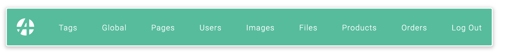<br>

When a customer will create an order, his `apostrophe-user` account will be used to authenticate the call in the backend. Currently, the `customer` group has no permission.
Add the `edit-order` permission to this group in `backend/lib/modules/apostrophe-users/index.js`:

```js
module.exports = {
  groups: [
    {
      title: 'customer',
      permissions: ['edit-order'],
    },
    ...
  ]
  ...
}
```

Apostrophe has default permissions. When a `admin-name-of-the-module` permission is added to a group of users, they can manage all documents relative to this module. However, the `edit-name-of-the-module` permission restricts modifications to the documents they created individually. This is exactly what we need. In our case, a customer will only manage its own orders.

Let's create a Vue component to add orders in the frontend.

Start by creating a state `order` and a mutation in `frontend/store/index.js`:

```js
import Vue from 'vue'

export const state = () => ({
  order: {},
})

export const mutations = {
  addToOrder(state, payload) {
    Vue.set(state.order, payload, (state.order[payload] || 0) + 1)
  },
}
```
Here, we declare a empty `order` and each time `addToOrder` is called, it adds a new dish to the order.
If this is not familiar to you, consult the [Vuex documentation](https://vuex.vuejs.org/), the state manager from Vue.

Import the mutation in `frontend/pages/index.vue` and add it to the `methods` used in this component:

```js
<script>
  import { mapMutations } from 'vuex'
  import LoginModal from '~/components/LoginModal'

  export default {
    components: {
      LoginModal,
    },

    async asyncData({ $axios }) {
      ...
    },

    methods: {
      ...mapMutations(['addToOrder']),
      add(product) {
        this.addToOrder(product)
      },
    },
  }
</script>
```

Still in this file, add 2 elements to the `template` part, under the `img` tag:

```html
<v-btn v-if="$store.state.auth && $store.state.auth.loggedIn" color="primary" class="white-text" @click="add(product.title)">Order</v-btn>
<LoginModal v-else classes="primary white-text" :block="true" :redirect-to="$route.fullPath" label="Order" />
```

The template should look like this:
```html
<template>
  <section class="homepage">
    <!-- eslint-disable-next-line vue/no-v-html -->
    <div v-html="content"></div>
    <div class="homepage-products">
      <div v-for="product in products" :key="product._id" class="homepage-products__item">
        
        <v-btn v-if="$store.state.auth && $store.state.auth.loggedIn" color="primary" class="white-text" @click="add(product.title)">Order</v-btn>
        <LoginModal v-else classes="primary white-text" :block="true" :redirect-to="$route.fullPath" label="Order" />
        <span>{{ product.description }}</span>
      </div>
    </div>
  </section>
</template>
```

When logged in, the user sees an "Order" button. When it clicks on it, it triggers the Vuex mutation `addToOrder`.


Add a badge next to "My Order", in the top bar. Go to `frontend/components/Nav.vue` and add this around "My Order" in the template:

```html
<v-badge color="green" :content="counter">My Order</v-badge>
```

then modify the `computed` part in `<script>` this way:

```js
computed: {
  ...mapState(['auth', 'order']),
  counter() {
    if (!Object.values(this.order).length) {
      return '0'
    }
    return Object.values(this.order).reduce((acc, cur) => (acc += cur), 0)
  },
},
```

Also, add a `scss` rule to `<style>` render the badge correctly:

```css
.v-badge__badge {
  display: flex;
  align-items: center;
  justify-content: center;
  padding: 0;
}
```

The whole Nav component is the following:

```js
<template>
  <v-app-bar app hide-on-scroll flat>
    <!-- small mobile screens only -->
    <template v-if="$vuetify.breakpoint.xsOnly">
      <v-menu offset-y>
        <template #activator="{ on }">
          <v-app-bar-nav-icon v-on="on" />
        </template>
        <v-list>
          <v-list-item>
            <v-btn class="v-btn--mobile v-btn--home" text to="/" nuxt block> Home </v-btn>
          </v-list-item>
        </v-list>
      </v-menu>
    </template>

    <!-- large smartphones, tablets and desktop view -->
    <template v-else>
      <v-toolbar-items>
        <v-btn class="v-btn--home" text to="/" nuxt> Home </v-btn>
      </v-toolbar-items>
    </template>

    <v-spacer />

    <v-toolbar-items>
      <template v-if="auth.loggedIn">
        <v-btn text>
          <v-badge color="green" :content="counter">My Order</v-badge>
        </v-btn>
        <v-btn text @click="logout">Logout</v-btn>
      </template>
      <template v-else>
        <RegisterModal />
        <LoginModal :redirect-to="$route.fullPath" />
      </template>
    </v-toolbar-items>
  </v-app-bar>
</template>

<script>
import { mapState } from 'vuex'
import LoginModal from '~/components/LoginModal'
import RegisterModal from '~/components/RegisterModal'

export default {
  components: {
    LoginModal,
    RegisterModal,
  },

  computed: {
    ...mapState(['auth', 'order']),
    counter() {
      if (!Object.values(this.order).length) {
        return '0'
      }
      return Object.values(this.order).reduce((acc, cur) => (acc += cur), 0)
    },
  },

  methods: {
    logout() {
      this.$auth.logout()
    },
  },
}
</script>

<style lang="scss">
.v-btn--mobile:hover {
  height: 100%;
}
.v-btn--home::before {
  opacity: 0 !important;
}
.v-toolbar__content {
  padding: 0 !important;
}
.v-badge__badge {
  display: flex;
  align-items: center;
  justify-content: center;
  padding: 0;
}
</style>
```

As the state is updated through the mutation `addToOrder`, components that listen to the `order` state are aware of the change. This updates the badge next to "My Order", in the top bar.

Order several dishes to see the badge increasing.

That would be nice to have the list of dishes we put in this order. For that, create a page by adding `order.vue` file in `frontent/pages`. Nuxt is smart enough to understand it has to update its internal router and add a route when a file is added into `pages`. By adding a `order` Vue component, it will automatically create the `/order` route.

```js
<template>
  <v-card>
    <v-list two-line>
      <v-list-item-group multiple>
        <template v-for="(item, index) in Object.values(order)">
          <v-list-item :key="item.title">
            <v-list-item-content>
              <v-list-item-title v-text="item.title"></v-list-item-title>

              <v-list-item-subtitle class="text--primary" v-text="item.description"></v-list-item-subtitle>
            </v-list-item-content>

            <div class="order-list">
              <v-text-field
                outlined
                class="order-quantity"
                :value="item.quantity"
                color="primary"
                required
                @input="changeQuantity($event, item)"
              />
              <div class="order-actions">
                <v-btn icon @click="add(item)"><v-icon>add</v-icon></v-btn>
                <v-btn icon @click="remove(item)"><v-icon>remove</v-icon></v-btn>
              </div>
            </div>
          </v-list-item>

          <v-divider v-if="index < Object.values(order).length - 1" :key="index"></v-divider>
        </template>
      </v-list-item-group>
    </v-list>
    <v-card-actions>
      <v-btn v-if="Object.values(order).length" block color="primary" :loading="loading" @click="proceed">
        Proceed
      </v-btn>
    </v-card-actions>
  </v-card>
</template>

<script>
import { mapActions, mapMutations, mapState } from 'vuex'

export default {
  data() {
    return {
      loading: false,
    }
  },

  head: {
    titleTemplate: '%s - My Order',
  },

  computed: {
    ...mapState(['auth', 'order']),
  },

  methods: {
    ...mapActions('snackbar', ['displaySnack']),
    ...mapMutations(['addToOrder', 'removeFromOrder', 'updateQuantity', 'emptyOrder']),
    changeQuantity(quantity, item) {
      this.updateQuantity({ ...item, quantity })
    },
    add(product) {
      this.addToOrder(product)
    },
    remove(product) {
      this.removeFromOrder(product)
    },
    async proceed() {
      this.loading = true
      try {
        const date = Date.now()
        await this.$axios.post('/api/v1/orders', {
          title: `${this.auth.user.email} - ${date}`,
          customerId: this.auth.user._id,
          productsIds: arr.map(product => product._id),
          productsRelationships: arr.reduce((acc, cur) => ({ ...acc, [cur._id]: { quantity: cur.quantity } }), {}),
          date,
        })

        this.loading = false
        this.emptyOrder()
        this.$router.push('/')
        this.displaySnack({ message: 'Order received. It will be ready soon.' })
      } catch (error) {
        this.loading = false
        this.displaySnack({ message: 'Something went wrong', color: 'error' })
      }
    },
  },
}
</script>

<style lang="scss" scoped>
.order-list {
  display: flex;
  position: relative;
  top: 20px;
}

.order-quantity {
  width: 50px;
  margin-right: 40px;
}

.order-actions {
  display: flex;
  flex-direction: column;
}

.v-card__actions {
  position: absolute;
  bottom: 0;
  width: 100%;
  padding: 0;

  .v-btn {
    padding: 0;
  }
}
</style>
```

We used three additionals mutations in this component. Add them to `frontend/store/index.js`:

```js
export const mutations = {
  addToOrder(state, payload) {
    ...
  },
  updateQuantity(state, payload) {
    state.order[payload.slug].quantity = payload.quantity
  },
  removeFromOrder(state, payload) {
    if (state.order[payload.slug].quantity > 0) {
      state.order[payload.slug].quantity--
    }
  },
  emptyOrder(state) {
    state.order = {}
  },
}
```

The `order` page is ready. Order food in the homepage, click multiple times on a "Order" button to add the same dish several times. Now, click in "My Order" in the top bar, you are being redirected to "/order" and will see a page similar to this:

<br>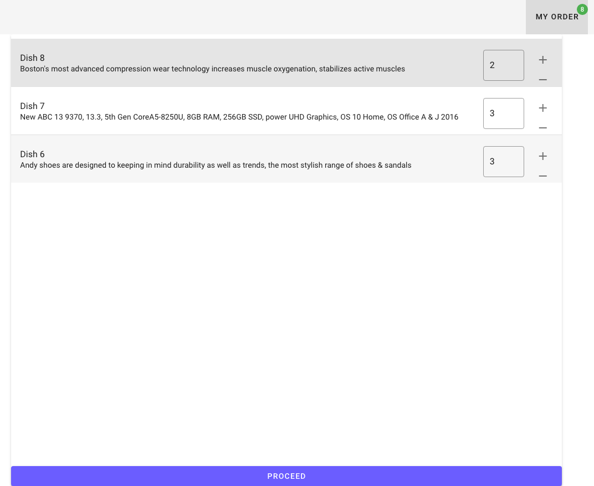<br>

You can adjust the quantities here also. Then, click on "Proceed". It will generate a POST request and contact the backend REST API. Apostrophe will handle that and create the corresponding order. You can go the backend and check that by clicking on the "Orders" button in the Apostrophe admin bar on `http://localhost/cms` (or `http://localhost:1337/cms`).

<br>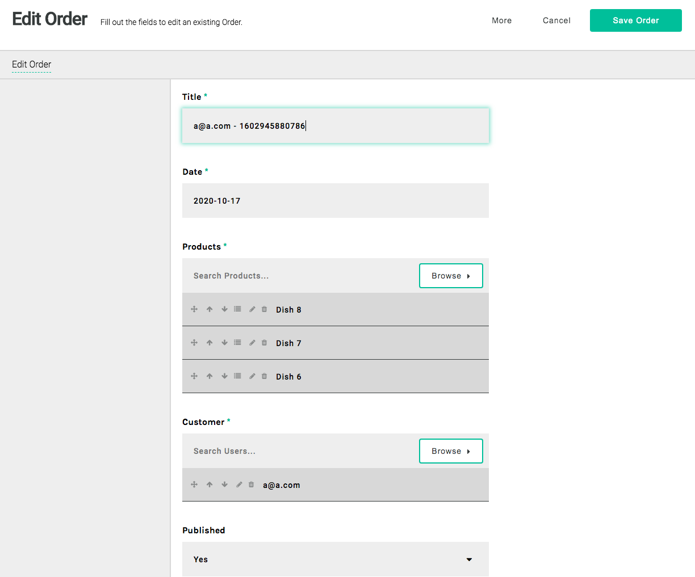<br>

You can even click on the "Relationship" button on a joined product, and see the right quantity was sent.

<br>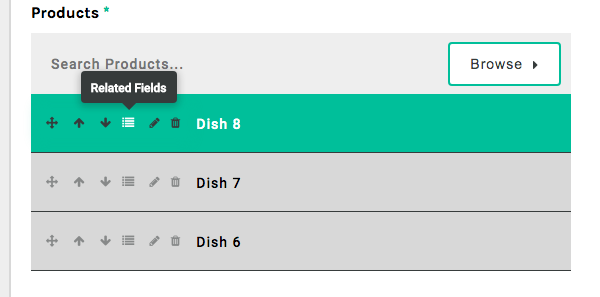<br>

<br>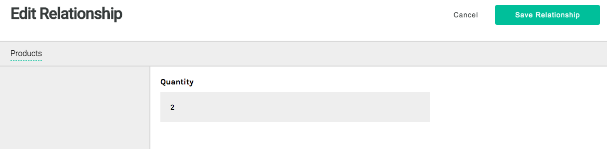<br>

This happened thanks to the ["relationship" field](https://docs.apostrophecms.org/reference/field-types/joinbyarray.html#relationship-properties-and-joinbyarray) in Apostrophe. In the frontend call, there was this:

```js
productsRelationships: arr.reduce((acc, cur) => ({ ...acc, [cur._id]: { quantity: cur.quantity } }), {}),
```

indicating to add an object `productsRelationships` to the new order. Apostrophe understands this as a property of the joined field `_products` as specified in the `backend/order/index.js` schema:

```js
{
  name: '_products',
  type: 'joinByArray',
  required: true,
  relationship: [
    {
      name: 'quantity',
      label: 'Quantity',
      type: 'integer',
    }
  ],
},
```

The restaurant has all it needs to handle orders from their online customers. This tutorial had the ambition to demonstrate how nicely Apostrophe can interact with frontend frameworks such as Vue/Nuxt in a Docker environment.

You can access the [full version here](https://github.com/falkodev/apos-nuxt-demo/tree/develop).

We stop here to keep it simple. We could have added email notifications, online payments and many options available in the numerous plugins available in the Apostrophe world. You can discover more by browsing the [online documentation](https://docs.apostrophecms.org/), exploring plugins to [extend our open-source CMS](https://apostrophecms.com/extend) or by joining our [vibrant community](https://apostrophecms.com/community).
